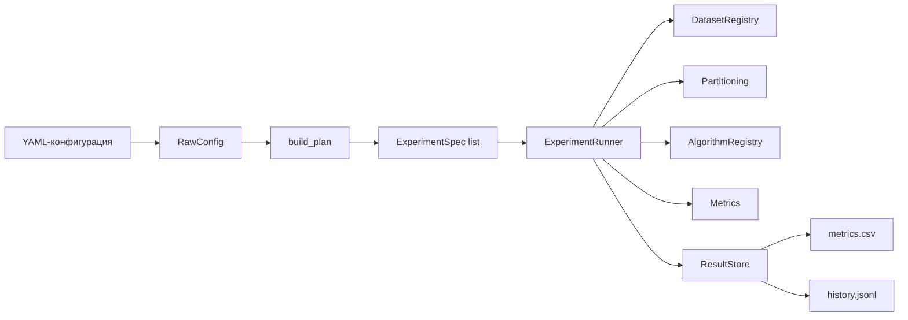
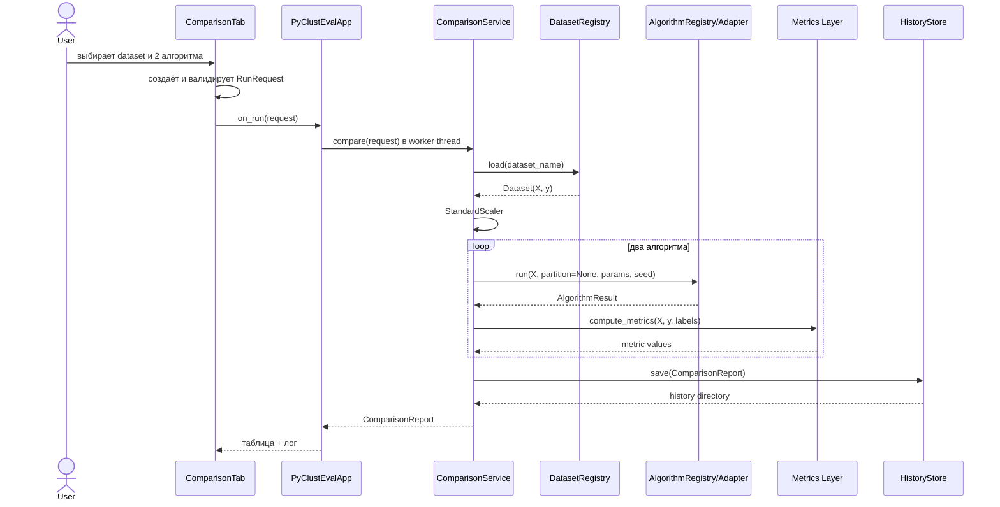
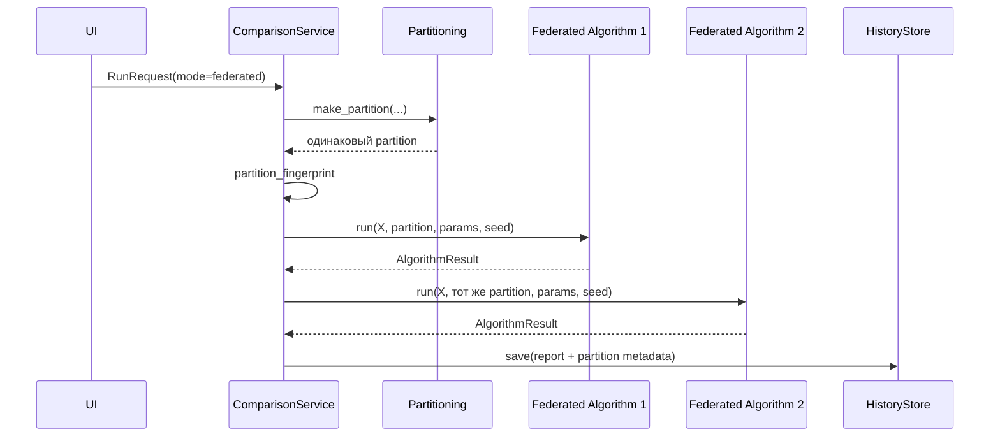
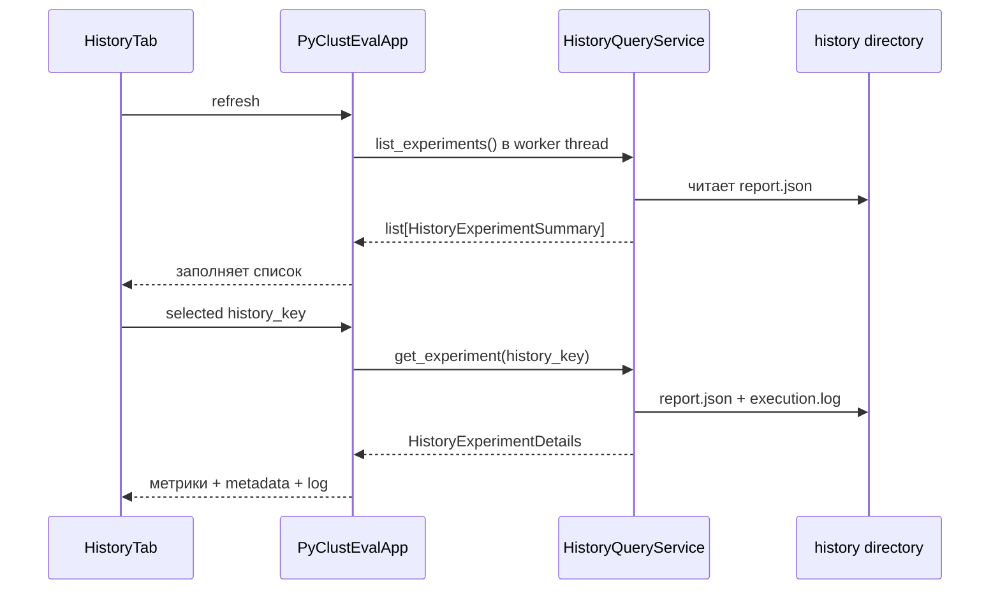

# PyClustEval: техническо-архитектурная документация

## 1. Назначение документа

Этот документ описывает технические компоненты PyClustEval в том порядке, в котором они участвуют в работе бенчмарка: от пользовательского действия или CLI-команды до загрузки данных, запуска алгоритма, вычисления метрик и сохранения истории.

Для каждого компонента указаны:

- назначение;
- выполняемая функциональность;
- место реализации;
- основные зависимости;
- короткий пример использования или взаимодействия.

Документ соответствует текущей структуре проекта с desktop UI, локальными алгоритмами, NumPy-федеративными реализациями, Flower Simulation, typed DTO и вкладкой истории.

---

## 2. Общая архитектурная схема

В проекте существуют два пользовательских контура запуска.

### 2.1. Интерактивный desktop-контур

```mermaid
flowchart LR
    U[Пользователь] --> UI[PyClustEval UI]
    UI --> REQ[RunRequest]
    REQ --> CS[ComparisonService]
    CS --> DR[DatasetRegistry]
    DR --> PP[StandardScaler]
    PP --> PART[Partitioning]
    PART --> AR[AlgorithmRegistry]
    AR --> ALG[Algorithm Adapter]
    ALG --> MET[Metrics]
    MET --> REP[ComparisonReport]
    REP --> HS[HistoryStore]
    HS --> FILES[report.json / results.csv / execution.log]
    FILES --> HQ[HistoryQueryService]
    HQ --> UI
```



Это основной контур приложения. UI создаёт типизированный запрос, а вся orchestration-логика находится в `ComparisonService`.

### 2.2. Пакетный CLI-контур



CLI-контур предназначен для массового запуска комбинаций параметров. Он исторически существует параллельно desktop-контуру и использует отдельные модели конфигурации и отдельное хранилище результатов.

---

# Часть I. Интерактивный desktop-контур

## 3. Точка входа desktop-приложения

### Компонент: `PyClustEvalApp`

**Назначение:** создать главное окно приложения, связать UI-вкладки с application-сервисами и организовать безопасный обмен данными между worker-потоками и главным потоком Tkinter.

**Реализация:**

```text
pyclusteval_ui.py
```

**Основная функциональность:**

- создаёт `ComparisonService`;
- создаёт `HistoryQueryService`;
- получает доступные датасеты и алгоритмы через application-слой;
- создаёт вкладки локального запуска, федеративного запуска и истории;
- запускает длительные операции в `threading.Thread`;
- принимает события через `queue.Queue`;
- обновляет Tkinter только в главном UI-потоке;
- после завершения эксперимента автоматически обновляет вкладку истории.

**Почему это важно:** Tkinter не является thread-safe. Алгоритмы и чтение истории могут занимать заметное время, поэтому они запускаются в фоновых потоках, а UI получает только события.

**Упрощённый пример:**

```python
app = PyClustEvalApp()
app.mainloop()
```

**Используемые компоненты:**

- `ComparisonService`;
- `HistoryQueryService`;
- `RunRequest`;
- `ComparisonTab`;
- `HistoryTab`;
- `queue.Queue`;
- `threading.Thread`.

---

## 4. Вкладка запуска сравнения

### Компонент: `ComparisonTab`

**Назначение:** собрать от пользователя параметры одного сравнения и отобразить текущий лог и итоговые метрики.

**Реализация:**

```text
pyclusteval_ui.py
```

**Функциональность:**

- выбор датасета;
- выбор двух разных алгоритмов;
- ввод `seed`;
- для федеративного режима — ввод количества клиентов;
- выбор IID или Dirichlet partitioning;
- ввод `Dirichlet alpha`;
- первичная проверка пользовательского ввода;
- создание `RunRequest`;
- блокировка кнопки во время выполнения;
- отображение `AlgorithmRunReport` в таблице;
- отображение поступающих логов.

`ComparisonTab` не загружает датасет, не выполняет preprocessing, не создаёт partition и не запускает алгоритм. Это принципиальная граница presentation-слоя.

**Пример создаваемого запроса:**

```python
request = RunRequest(
    mode="federated",
    dataset_name="iris",
    algorithms=(
        "fed_kmeans_numpy",
        "fed_fuzzy_cmeans_numpy",
    ),
    seed=42,
    num_clients=5,
    partition_mode="iid",
    dirichlet_alpha=0.5,
)
```

**Переход к следующему компоненту:** сформированный `RunRequest` передаётся в `PyClustEvalApp.start_run()`, а затем — в `ComparisonService.compare()`.

---

## 5. Вкладка истории

### Компонент: `HistoryTab`

**Назначение:** показать список сохранённых сравнений и подробности выбранного эксперимента.

**Реализация:**

```text
pyclusteval_ui.py
```

**Функциональность:**

- показывает дату, режим, датасет, алгоритмы и длительность каждого запуска;
- выбирает эксперимент по `history_key`;
- отображает метрики обоих алгоритмов;
- отображает параметры partition;
- отображает `execution.log`;
- позволяет обновить список истории.

**Архитектурное ограничение:** вкладка не читает `report.json` и `execution.log` напрямую. Она работает только с DTO, возвращаемыми `HistoryQueryService`.

**Пример данных, которые получает UI:**

```python
HistoryExperimentSummary(
    history_key="2026-07-31_12-30-15",
    experiment_id="6f8a...",
    mode="local",
    dataset_name="iris",
    algorithms=("kmeans", "agglomerative"),
    duration_sec=0.18,
    result_count=2,
)
```

---

## 6. Общие UI-функции отображения результатов

### Компоненты

- `_create_results_table()`;
- `_fmt()`;
- `_insert_results()`.

**Реализация:**

```text
pyclusteval_ui.py
```

**Назначение:** централизовать создание таблиц и форматирование метрик, чтобы текущие результаты и исторические результаты отображались одинаково.

**Функциональность:**

- создаёт `ttk.Treeview` с фиксированным набором колонок;
- преобразует `None` и `NaN` в символ `—`;
- форматирует числа с плавающей точкой;
- переносит данные `AlgorithmRunReport` в строки таблицы.

---

# Часть II. Типизированная граница application-слоя

## 7. DTO запроса запуска

### Компонент: `RunRequest`

**Назначение:** типизированно передать все параметры одного интерактивного сравнения из UI в application-слой.

**Реализация:**

```text
clustering_eval/application/dto.py
```

**Поля:**

- `mode`: `local` или `federated`;
- `dataset_name`: имя датасета в `DatasetRegistry`;
- `algorithms`: ровно два имени алгоритмов;
- `seed`: seed эксперимента;
- `num_clients`: количество федеративных клиентов;
- `partition_mode`: `iid` или `dirichlet`;
- `dirichlet_alpha`: параметр неоднородности;
- `algorithm_params`: дополнительные параметры алгоритмов.

**Функциональность `validate()`:**

- проверяет поддерживаемый режим;
- запрещает пустое имя датасета;
- требует ровно два алгоритма;
- запрещает сравнение алгоритма с самим собой;
- проверяет минимальное количество клиентов;
- проверяет partition mode;
- проверяет положительность `dirichlet_alpha`.

**Пример:**

```python
request = RunRequest(
    mode="local",
    dataset_name="blobs",
    algorithms=("kmeans", "gmm"),
    seed=42,
)
request.validate()
```

---

## 8. DTO результата одного алгоритма

### Компонент: `AlgorithmRunReport`

**Назначение:** представить результат запуска одного алгоритма в формате, удобном для UI, истории и сериализации.

**Реализация:**

```text
clustering_eval/application/dto.py
```

**Поля:**

- имя алгоритма;
- backend исполнения;
- runtime;
- оценка сетевого обмена;
- число раундов;
- ARI;
- NMI;
- Silhouette;
- Davies–Bouldin;
- Calinski–Harabasz;
- `model_state`;
- история итераций или федеративных раундов.

**Пример:**

```python
report = AlgorithmRunReport(
    algorithm="kmeans",
    backend="local",
    runtime_sec=0.024,
    communication_bytes=0,
    rounds="—",
    ari=0.73,
    nmi=0.76,
    silhouette=0.55,
    davies_bouldin=0.66,
    calinski_harabasz=561.2,
)
```

---

## 9. DTO описания partition

### Компонент: `PartitionReport`

**Назначение:** сохранить проверяемое описание разбиения датасета между федеративными клиентами.

**Реализация:**

```text
clustering_eval/application/dto.py
```

**Поля:**

- режим разбиения;
- количество клиентов;
- число объектов каждого клиента;
- fingerprint разбиения;
- `dirichlet_alpha`, если использован Dirichlet.

**Почему fingerprint важен:** он позволяет проверить, что два сравниваемых федеративных алгоритма действительно получили одинаковые индексы клиентов.

---

## 10. DTO полного интерактивного эксперимента

### Компонент: `ComparisonReport`

**Назначение:** собрать всю информацию о сравнении двух алгоритмов в единый объект.

**Реализация:**

```text
clustering_eval/application/dto.py
```

**Содержит:**

- `experiment_id`;
- время начала и завершения;
- исходный `RunRequest`;
- название и размер датасета;
- два `AlgorithmRunReport`;
- `PartitionReport` для федеративного режима;
- строки execution log;
- путь к каталогу истории.

**Функциональность:**

- вычисляет общую длительность через `duration_sec`;
- преобразуется в словарь методом `to_dict()`;
- преобразует `datetime` и `Path` в сериализуемый вид.

---

## 11. DTO чтения истории

### Компоненты

- `HistoryExperimentSummary`;
- `HistoryExperimentDetails`.

**Реализация:**

```text
clustering_eval/application/dto.py
```

### `HistoryExperimentSummary`

Используется для списка истории. Содержит только лёгкие данные, необходимые для таблицы: дату, режим, датасет, алгоритмы, длительность и число результатов.

### `HistoryExperimentDetails`

Используется после выбора конкретного запуска. Содержит:

- полную информацию о датасете;
- seed;
- результаты алгоритмов;
- partition metadata;
- текст execution log.

**Архитектурный эффект:** UI не зависит от формата JSON-файла и структуры каталога `history/`.

---

# Часть III. Orchestration эксперимента

## 12. Главный application-сервис

### Компонент: `ComparisonService`

**Назначение:** выполнить полный интерактивный сценарий сравнения двух алгоритмов.

**Реализация:**

```text
clustering_eval/application/comparison_service.py
```

**Это центральный компонент desktop-контура.** Все последующие компоненты вызываются им последовательно.

### 12.1. Зависимости сервиса

- `DatasetRegistry` — загрузка датасета;
- `StandardScaler` — preprocessing;
- partitioning-функции — федеративное разбиение;
- `AlgorithmRegistry` — разрешение имён алгоритмов;
- algorithm adapters — выполнение алгоритмов;
- `compute_metrics()` — оценка качества;
- `HistoryStore` — сохранение результата;
- DTO — вход и выход application-слоя.

### 12.2. Последовательность `compare()`

1. Валидирует `RunRequest`.
2. Фиксирует время начала.
3. Загружает датасет.
4. Извлекает `X`, `y` и display name.
5. Масштабирует признаки через `StandardScaler`.
6. В федеративном режиме создаёт partition один раз.
7. Вычисляет fingerprint partition.
8. Формирует параметры алгоритмов.
9. Последовательно запускает два алгоритма.
10. Проверяет соответствие алгоритма выбранному режиму.
11. Преобразует низкоуровневый `AlgorithmResult` в `AlgorithmRunReport`.
12. Вычисляет метрики.
13. Формирует `ComparisonReport`.
14. Сохраняет JSON, CSV и log через `HistoryStore`.
15. Возвращает отчёт UI.

### 12.3. Короткий пример прямого использования

```python
from clustering_eval.application import ComparisonService, RunRequest

service = ComparisonService()
report = service.compare(
    RunRequest(
        mode="local",
        dataset_name="iris",
        algorithms=("kmeans", "agglomerative"),
        seed=42,
    )
)

print(report.results[0].ari)
print(report.history_directory)
```

### 12.4. Внедрение зависимостей

Конструктор позволяет передать собственные registry и store:

```python
service = ComparisonService(
    algorithms=my_algorithm_registry,
    datasets=my_dataset_registry,
    history_store=my_history_store,
)
```

Это используется в тестах и позволяет расширять систему без изменения UI.

---

## 13. Адаптационные функции `ComparisonService`

### Компоненты

- `_registry_names()`;
- `_get_registry_item()`;
- `_is_federated()`;
- `_load_dataset()`;
- `_extract_xy()`;
- `_invoke_algorithm()`;
- `_extract_result()`.

**Реализация:**

```text
clustering_eval/application/comparison_service.py
```

**Назначение:** ослабить связанность orchestration-слоя с конкретной реализацией registry, dataset loader или пользовательского алгоритма.

### `_registry_names()`

Получает список элементов из registry через несколько возможных соглашений: `names()`, `keys()`, внутренние mapping-поля и резервное обнаружение известных имён.

### `_get_registry_item()`

Пробует получить объект через `get()`, `load()`, `create()` или внутренний словарь.

### `_is_federated()`

Определяет федеративность по:

- `is_federated`;
- `federated`;
- `backend`;
- `execution_backend`;
- имени алгоритма.

### `_invoke_algorithm()`

Адаптирует разные сигнатуры сторонних алгоритмов. Поддерживает алиасы:

```text
X / x / data
partition / partitions / client_partitions
params / parameters
seed / random_state
```

Благодаря этому custom-алгоритм может быть подключён с небольшой вариативностью сигнатуры.

### `_extract_result()`

Извлекает из результата:

- labels;
- runtime;
- communication bytes;
- model state;
- history.

Также допускает возврат обычного `np.ndarray` с labels.

---

# Часть IV. Датасеты и preprocessing

## 14. Модель датасета

### Компонент: `Dataset`

**Назначение:** унифицировать представление данных для всех алгоритмов.

**Реализация:**

```text
clustering_eval/datasets/base.py
```

**Поля:**

- `name`;
- `X` — матрица признаков;
- `y` — эталонные метки, если они существуют;
- `metadata` — информация об источнике и параметрах генерации.

**Пример:**

```python
Dataset(
    name="custom",
    X=my_features,
    y=my_labels,
    metadata={"source": "internal"},
)
```

---

## 15. Реестр датасетов

### Компонент: `DatasetRegistry`

**Назначение:** разрешать строковое имя датасета в loader-функцию.

**Реализация:**

```text
clustering_eval/datasets/registry.py
```

**Функциональность:**

- `register(name, loader)` добавляет loader;
- `load(name, params)` загружает датасет;
- неизвестное имя приводит к информативному `KeyError`.

### Стандартный registry

Функция `default_registry()` регистрирует:

- `iris`;
- `wine`;
- `digits`;
- `blobs`.

Первые три загружаются из `sklearn.datasets`. `blobs` генерируется через `make_blobs()` и принимает параметры генерации.

**Пример добавления датасета:**

```python
def load_custom(params):
    return Dataset("custom", X, y, {"source": "csv"})

registry = DatasetRegistry()
registry.register("custom", load_custom)
dataset = registry.load("custom")
```

**Переход к следующему компоненту:** загруженный `Dataset.X` передаётся preprocessing-этапу.

---

## 16. Preprocessing

### Компонент: стандартизация признаков

**Назначение:** привести признаки к сопоставимому масштабу перед кластеризацией.

**Реализация:**

```text
clustering_eval/application/comparison_service.py
```

В desktop-контуре используется:

```python
X = StandardScaler().fit_transform(
    np.asarray(X_raw, dtype=np.float64)
)
```

**Функциональность:**

- преобразует данные в `float64`;
- центрирует каждый признак;
- масштабирует по стандартному отклонению;
- выполняется один раз до запуска обоих алгоритмов.

Это обеспечивает честность сравнения: оба алгоритма получают одну и ту же обработанную матрицу.

**Текущая особенность:** preprocessing пока не выделен в самостоятельный класс или pipeline и не настраивается пользователем.

---

# Часть V. Разбиение данных между клиентами

## 17. IID partitioning

### Компонент: `iid_partition()`

**Назначение:** случайно и примерно равномерно распределить объекты между клиентами.

**Реализация:**

```text
clustering_eval/datasets/partitioning.py
```

**Алгоритм:**

1. Проверяет параметры.
2. Создаёт перестановку индексов с заданным seed.
3. Делит массив индексов через `np.array_split()`.

**Пример:**

```python
parts = iid_partition(
    n_samples=150,
    num_clients=5,
    seed=42,
)
```

Результат — `list[np.ndarray]`, где каждый массив содержит индексы объектов конкретного клиента.

---

## 18. Dirichlet partitioning

### Компонент: `dirichlet_partition()`

**Назначение:** создать label-aware non-IID разбиение, при котором распределение классов различается между клиентами.

**Реализация:**

```text
clustering_eval/datasets/partitioning.py
```

**Функциональность:**

- для каждого класса генерирует клиентские пропорции из распределения Дирихле;
- распределяет индексы класса через multinomial sampling;
- повторяет построение, если появились пустые клиенты;
- использует детерминированные дочерние seeds;
- при отсутствии `y` переходит к IID-разбиению.

**Влияние `alpha`:**

- большое значение даёт более равномерное распределение;
- малое значение создаёт более выраженную неоднородность клиентов.

**Пример:**

```python
parts = dirichlet_partition(
    y=labels,
    n_samples=len(labels),
    num_clients=5,
    alpha=0.3,
    seed=42,
)
```

---

## 19. Единая фабрика partition

### Компонент: `make_partition()`

**Назначение:** предоставить orchestration-слою одну точку выбора стратегии разбиения.

**Реализация:**

```text
clustering_eval/datasets/partitioning.py
```

**Пример:**

```python
partition = make_partition(
    mode="dirichlet",
    n_samples=len(X),
    num_clients=5,
    seed=42,
    y=y,
    alpha=0.5,
)
```

---

## 20. Идентификатор partition

### Компонент: `partition_fingerprint()`

**Назначение:** создать стабильный короткий идентификатор конкретного набора клиентских индексов.

**Реализация:**

```text
clustering_eval/datasets/partitioning.py
```

**Функциональность:**

1. Преобразует индексы клиентов в JSON.
2. Вычисляет SHA-256.
3. Использует первые 16 hex-символов.

**Пример результата:**

```text
8ec64f8dc2601f2a
```

Этот идентификатор сохраняется в отчётах и позволяет проверять честность федеративного сравнения.

---

# Часть VI. Единый контракт алгоритмов

## 21. Базовый интерфейс алгоритма

### Компонент: `ClusteringAlgorithm`

**Назначение:** определить единый вызов для локальных, NumPy-федеративных и Flower-алгоритмов.

**Реализация:**

```text
clustering_eval/algorithms/base.py
```

**Контракт:**

```python
def run(
    self,
    X: np.ndarray,
    partition: list[np.ndarray] | None,
    params: dict[str, Any],
    seed: int,
) -> AlgorithmResult:
    ...
```

**Семантика:**

- локальный алгоритм получает `partition=None`;
- федеративный алгоритм получает список клиентских индексов;
- `params` содержит алгоритмические и execution-параметры;
- `seed` обеспечивает воспроизводимость.

---

## 22. Низкоуровневый результат алгоритма

### Компонент: `AlgorithmResult`

**Назначение:** вернуть результат любого алгоритмического backend в унифицированном формате.

**Реализация:**

```text
clustering_eval/algorithms/base.py
```

**Поля:**

- `labels` — итоговый кластер каждого объекта;
- `model_state` — параметры итоговой модели;
- `history` — история итераций или раундов;
- `runtime_sec`;
- `communication_bytes`.

**Отличие от `AlgorithmRunReport`:**

- `AlgorithmResult` принадлежит algorithm-слою;
- `AlgorithmRunReport` принадлежит application-слою и дополнительно содержит рассчитанные метрики и presentation-friendly metadata.

---

## 23. Реестр алгоритмов

### Компонент: `AlgorithmRegistry`

**Назначение:** связать строковое имя алгоритма с его adapter-объектом.

**Реализация:**

```text
clustering_eval/algorithms/registry.py
```

**Методы:**

- `register(algorithm)`;
- `get(name)`;
- `names()`.

### Стандартный registry

`default_registry()` регистрирует десять реализаций:

#### Локальные

- `kmeans`;
- `dbscan`;
- `gmm`;
- `agglomerative`.

#### Федеративные NumPy

- `fed_kmeans_numpy`;
- `fed_fuzzy_cmeans_numpy`;
- `fed_gmm_diag_numpy`.

#### Flower Simulation

- `fed_kmeans_flower`;
- `fed_fuzzy_cmeans_flower`;
- `fed_gmm_diag_flower`.

**Пример:**

```python
registry = default_registry()
algorithm = registry.get("fed_kmeans_numpy")
result = algorithm.run(X, partition, {"k": 3}, seed=42)
```

---

# Часть VII. Локальные алгоритмы

## 24. Локальный K-Means

### Компонент: `SklearnKMeans`

**Назначение:** предоставить локальную baseline-реализацию K-Means.

**Реализация:**

```text
clustering_eval/algorithms/sklearn_algorithms.py
```

**Backend:** `sklearn.cluster.KMeans`.

**Параметры:**

- `k`;
- `max_iter`;
- seed передаётся как `random_state`.

**Результат:** labels, центры кластеров, inertia и runtime.

---

## 25. Локальный DBSCAN

### Компонент: `SklearnDBSCAN`

**Назначение:** сравнивать centroid-based алгоритмы с density-based кластеризацией.

**Реализация:**

```text
clustering_eval/algorithms/sklearn_algorithms.py
```

**Backend:** `sklearn.cluster.DBSCAN`.

**Параметры:**

- `eps`;
- `min_samples`.

**Особенность:** DBSCAN может возвращать `-1` для шумовых объектов. Metrics Layer учитывает noise label при проверке количества кластеров.

---

## 26. Локальная Gaussian Mixture Model

### Компонент: `SklearnGMM`

**Назначение:** предоставить вероятностную model-based кластеризацию.

**Реализация:**

```text
clustering_eval/algorithms/sklearn_algorithms.py
```

**Backend:** `sklearn.mixture.GaussianMixture`.

**Параметры:**

- `k`, преобразуемый в `n_components`;
- seed.

**Результат:** labels и веса компонент.

---

## 27. Локальная агломеративная кластеризация

### Компонент: `SklearnAgglomerative`

**Назначение:** предоставить иерархический baseline без итеративной centroid-модели.

**Реализация:**

```text
clustering_eval/algorithms/sklearn_algorithms.py
```

**Backend:** `sklearn.cluster.AgglomerativeClustering`.

**Параметр:** `k`.

---

# Часть VIII. Федеративные NumPy-реализации

## 28. Общая модель NumPy federation

NumPy-федеративные алгоритмы моделируют клиент-серверные раунды внутри одного Python-процесса.

**Назначение этого backend:**

- предоставить reference implementation;
- тестировать федеративную математику без Flower и Ray;
- измерять количество передаваемых массивов;
- сравнивать результат с Flower-реализацией того же алгоритма.

**Общий цикл:**

```text
server model
  -> каждый клиент вычисляет sufficient statistics
  -> server суммирует statistics
  -> server обновляет global model
  -> следующий раунд
```

Сырые клиентские данные используются только на локальном шаге конкретного partition.

---

## 29. Федеративный K-Means на NumPy

### Компонент: `FedKMeansNumpy`

**Реализация:**

```text
clustering_eval/algorithms/fed_kmeans_numpy.py
```

**Назначение:** синхронно выполнить федеративный K-Means без внешнего runtime.

**Клиентские statistics:**

- сумма векторов каждого кластера;
- количество объектов каждого кластера;
- локальная inertia.

**Серверное обновление:**

```text
new_center = total_cluster_sum / total_cluster_count
```

**Критерий остановки:** норма сдвига центров меньше `tol`.

**История:** для каждого раунда сохраняются `round`, `shift` и `inertia`.

---

## 30. Федеративный Fuzzy C-Means на NumPy

### Компонент: `FedFuzzyCMeansNumpy`

**Реализация:**

```text
clustering_eval/algorithms/federated_extra.py
```

**Назначение:** выполнить мягкую федеративную кластеризацию, где объект имеет степень принадлежности каждому кластеру.

**Параметры:**

- `k`;
- `rounds`;
- `tol`;
- `fuzziness`, значение должно быть больше 1.

**Клиентские statistics:**

- weighted sums;
- сумма membership weights;
- objective function.

**Серверное обновление:** глобальные центры рассчитываются из агрегированных weighted sums и weights.

**Результат:** hard labels формируются по ближайшему итоговому центру.

---

## 31. Федеративная diagonal GMM на NumPy

### Компонент: `FedDiagonalGMMNumpy`

**Реализация:**

```text
clustering_eval/algorithms/federated_extra.py
```

**Назначение:** реализовать федеративный EM-алгоритм для Gaussian Mixture Model с диагональной covariance matrix.

**Клиентский E-step:**

- вычисляет responsibilities;
- возвращает `Nk`;
- возвращает `sum_x`;
- возвращает `sum_x2`;
- вычисляет локальный log likelihood.

**Серверный M-step:**

- обновляет веса компонент;
- обновляет means;
- обновляет diagonal variances;
- применяет `reg_covar` для численной устойчивости.

**История:** `shift` means и `log_likelihood` каждого раунда.

---

# Часть IX. Flower Simulation adapters

## 32. Назначение Flower-слоя

Flower adapters переносят тот же логический федеративный протокол в Flower Simulation Runtime.

**Основные runtime-компоненты Flower:**

- `ClientApp`;
- `ServerApp`;
- `Strategy`;
- `run_simulation()`;
- simulation supernodes;
- Ray-based backend, устанавливаемый через `flwr[simulation]`.

**Файлы реализации:**

```text
clustering_eval/flower_adapter/fed_kmeans_flower_adapter.py
clustering_eval/flower_adapter/federated_extra_flower.py
```

**Архитектурная роль adapter:** скрыть от `ComparisonService` все детали Flower. Для application-слоя Flower-реализация является обычным `ClusteringAlgorithm` и возвращает обычный `AlgorithmResult`.

---

## 33. Flower K-Means

### Компонент: `FedKMeansFlowerAdapter`

**Реализация:**

```text
clustering_eval/flower_adapter/fed_kmeans_flower_adapter.py
```

**Функциональность:**

1. Проверяет доступность Flower.
2. Проверяет наличие непустого partition.
3. Инициализирует глобальные центры.
4. Создаёт вложенный `KMeansClient`.
5. Создаёт вложенную `FedKMeansStrategy`.
6. Создаёт по клиенту на каждый partition.
7. Запускает `run_simulation()`.
8. Извлекает итоговые глобальные центры.
9. Вычисляет labels для полного `X`.
10. Возвращает историю, backend и communication bytes.

### Клиент

Получает centers и возвращает:

- cluster sums;
- cluster counts;
- inertia.

### Strategy

Отвечает за:

- начальные параметры;
- выбор всех клиентов;
- отправку centers;
- агрегацию statistics;
- обновление centers;
- учёт коммуникации;
- историю раундов.

**Execution metadata:**

```python
{
    "backend": "flower-simulation",
    "num_clients": 5,
    "rounds": 10,
}
```

---

## 34. Flower Fuzzy C-Means

### Компонент: `FedFuzzyCMeansFlowerAdapter`

**Реализация:**

```text
clustering_eval/flower_adapter/federated_extra_flower.py
```

**Назначение:** выполнить Fuzzy C-Means через ClientApp/ServerApp и custom Strategy.

**Клиент возвращает:**

- fuzzy weighted sums;
- membership weights;
- objective.

**Strategy агрегирует:**

- statistics всех клиентов;
- глобальные центры;
- shift и objective;
- коммуникационный объём.

---

## 35. Flower diagonal GMM

### Компонент: `FedDiagonalGMMFlowerAdapter`

**Реализация:**

```text
clustering_eval/flower_adapter/federated_extra_flower.py
```

**Назначение:** выполнить федеративный EM для diagonal GMM через Flower Simulation.

**Глобальные параметры:**

- means;
- variances;
- mixture weights.

**Клиент возвращает:**

- `Nk`;
- `sum_x`;
- `sum_x2`;
- local log likelihood.

**Strategy:** выполняет M-step и создаёт параметры следующего раунда.

---

## 36. Проверка зависимости Flower

### Компоненты

- inline import в `FedKMeansFlowerAdapter`;
- `_require_flower()` для дополнительных Flower-алгоритмов.

**Реализация:**

```text
clustering_eval/flower_adapter/fed_kmeans_flower_adapter.py
clustering_eval/flower_adapter/federated_extra_flower.py
```

**Назначение:** позволить использовать локальные и NumPy-федеративные алгоритмы без обязательной установки Flower.

При попытке запустить Flower-алгоритм без зависимости создаётся понятная runtime-ошибка с командой установки.

---

# Часть X. Метрики

## 37. Metrics Layer

### Компоненты

- `compute_metrics()`;
- `safe_metric()`.

**Реализация:**

```text
clustering_eval/metrics/clustering.py
```

**Поддерживаемые метрики:**

- Adjusted Rand Index;
- Normalized Mutual Information;
- Silhouette Score;
- Davies–Bouldin Index;
- Calinski–Harabasz Index.

### Внешние метрики

ARI и NMI требуют `y_true`. Если эталонных labels нет, возвращается `NaN`.

### Внутренние метрики

Silhouette, Davies–Bouldin и Calinski–Harabasz вычисляются только при наличии минимум двух non-noise кластеров.

### `safe_metric()`

Изолирует ошибки отдельных метрик. Если метрика не может быть вычислена, весь эксперимент не падает — возвращается `NaN`.

**Пример:**

```python
values = compute_metrics(
    X=X,
    y_true=y,
    y_pred=labels,
    requested=["ari", "silhouette"],
)
```

---

# Часть XI. Формирование и сохранение истории

## 38. Хранилище интерактивной истории

### Компонент: `HistoryStore`

**Назначение:** атомарно сохранять каждый успешный desktop-эксперимент в отдельный каталог.

**Реализация:**

```text
clustering_eval/results/history_store.py
```

### Структура каталога

```text
history/
└── YYYY-MM-DD_HH-MM-SS/
    ├── report.json
    ├── results.csv
    └── execution.log
```

При совпадении timestamp добавляется суффикс `_2`, `_3` и далее.

### `report.json`

Содержит полный `ComparisonReport`:

- request;
- dataset metadata;
- partition metadata;
- метрики;
- model state;
- round history;
- execution log;
- путь к каталогу.

### `results.csv`

Содержит по одной строке на алгоритм и предназначен для быстрого анализа в pandas, Excel или BI-инструменте.

### `execution.log`

Содержит пользовательский лог этапов выполнения.

### Атомарная запись

Файлы сначала записываются во временный файл в том же каталоге, затем заменяются через `os.replace()`. Это уменьшает риск частично записанного JSON или CSV.

### Сериализация NumPy

Функция `_json_default()` преобразует:

- `Path` в строку;
- `np.ndarray` в список;
- NumPy scalar в Python scalar;
- `set` в отсортированный список.

---

## 39. Финальное обновление отчёта

### Компонент: `HistoryStore.refresh_report()`

**Назначение:** повторно записать report и log после того, как сервис добавил финальную строку с путём сохранения.

**Реализация:**

```text
clustering_eval/results/history_store.py
```

Порядок:

1. `save()` создаёт каталог и базовые файлы.
2. `ComparisonService` добавляет в log путь к истории.
3. `refresh_report()` обновляет `report.json` и `execution.log`.

---

# Часть XII. Чтение истории

## 40. Read-only application-сервис истории

### Компонент: `HistoryQueryService`

**Назначение:** отделить чтение файлов истории от UI и вернуть только typed DTO.

**Реализация:**

```text
clustering_eval/application/history_query_service.py
```

### `list_experiments()`

- обходит дочерние каталоги `history/`;
- ищет `report.json`;
- пропускает повреждённые записи;
- преобразует JSON в `HistoryExperimentSummary`;
- сортирует от новых к старым;
- поддерживает `limit`.

**Пример:**

```python
service = HistoryQueryService("history")
recent = service.list_experiments(limit=20)
```

### `get_experiment()`

- безопасно разрешает `history_key`;
- защищается от path traversal через проверку имени;
- читает `report.json`;
- читает `execution.log`;
- преобразует данные в `HistoryExperimentDetails`.

**Пример:**

```python
details = service.get_experiment("2026-07-31_12-30-15")
print(details.results)
```

### Устойчивость

Повреждение одного каталога истории не ломает весь список. При построении списка ошибочная запись пропускается.

---

# Часть XIII. Пакетный benchmark-контур

## 41. YAML-конфигурация

### Компонент: `RawConfig`

**Назначение:** загрузить декларативную benchmark-конфигурацию из YAML.

**Реализация:**

```text
clustering_eval/experiments/config.py
```

**Пример:**

```python
raw = RawConfig.from_yaml("configs/example.yaml")
config = raw.data
```

**Пример конфигурации:**

```yaml
experiment:
  name: clustering_comparison
  seeds: [42, 43]
  repetitions: 2
  output_dir: results

partitioning:
  clients: [3, 5]
  modes: [iid, dirichlet]
  dirichlet_alpha: [0.5]

algorithms:
  - name: fed_kmeans_numpy
    params:
      k: [3, 4]
      rounds: [10]
```

---

## 42. Спецификация одного пакетного эксперимента

### Компонент: `ExperimentSpec`

**Назначение:** представить одну конкретную точку параметрического benchmark-плана.

**Реализация:**

```text
clustering_eval/experiments/planner.py
```

**Поля включают:**

- experiment name;
- dataset name и params;
- algorithm name и params;
- partition mode;
- количество клиентов;
- alpha;
- seed;
- repetition.

В отличие от `RunRequest`, `ExperimentSpec` описывает запуск одного алгоритма, а не сравнение ровно двух алгоритмов.

---

## 43. Разворачивание параметрической сетки

### Компонент: `expand_params()`

**Назначение:** преобразовать параметры со списками значений в Cartesian product отдельных словарей.

**Реализация:**

```text
clustering_eval/experiments/planner.py
```

**Пример:**

```python
expand_params({
    "k": [3, 4],
    "rounds": [10, 20],
})
```

Вернёт четыре комбинации.

---

## 44. Построитель benchmark-плана

### Компонент: `build_plan()`

**Назначение:** построить полный список `ExperimentSpec` из YAML-конфигурации.

**Реализация:**

```text
clustering_eval/experiments/planner.py
```

**Комбинирует:**

- датасеты;
- dataset params;
- алгоритмы;
- algorithm params;
- seeds;
- repetitions;
- число клиентов;
- partition modes;
- Dirichlet alpha.

**Результат:** плоский детерминированный список запусков.

---

## 45. Исполнитель пакетного плана

### Компонент: `ExperimentRunner`

**Назначение:** выполнить один `ExperimentSpec` или последовательность specs и записать табличный результат.

**Реализация:**

```text
clustering_eval/experiments/runner.py
```

### `run_one()`

1. Загружает датасет.
2. Добавляет seed в dataset params.
3. Создаёт partition.
4. Вычисляет partition fingerprint.
5. Получает алгоритм из registry.
6. Запускает algorithm adapter.
7. Вычисляет выбранные метрики.
8. Формирует плоскую строку результата.
9. Записывает строку через `ResultStore`.
10. Записывает model state и round history в JSONL.

### `run_many()`

Последовательно выполняет список specs и печатает прогресс в stdout.

**Пример:**

```python
runner = ExperimentRunner(
    metrics=["ari", "nmi", "silhouette"],
    output_dir="results",
)
rows = runner.run_many(specs)
```

---

## 46. Пакетное хранилище результатов

### Компонент: `ResultStore`

**Назначение:** сохранять результат массового CLI-benchmark.

**Реализация:**

```text
clustering_eval/results/store.py
```

**Функциональность:**

- накапливает плоские строки в памяти;
- после каждого `add()` перезаписывает `metrics.csv`;
- добавляет записи в `history.jsonl`.

**Форматы:**

```text
results/metrics.csv
results/history.jsonl
```

**Отличие от `HistoryStore`:**

- `HistoryStore` предназначен для одного интерактивного сравнения двух алгоритмов;
- `ResultStore` предназначен для большого набора независимых `ExperimentSpec`;
- форматы хранения пока не унифицированы.

---

## 47. CLI entry point

### Компонент: `main()`

**Реализация:**

```text
clustering_eval/cli.py
```

**Назначение:** предоставить команду запуска benchmark из терминала.

**Установленная команда:**

```text
clustereval
```

Она объявлена в `pyproject.toml`:

```toml
[project.scripts]
clustereval = "clustering_eval.cli:main"
```

**Пример запуска:**

```bash
clustereval run configs/example.yaml
```

Ограничение числа запусков:

```bash
clustereval run configs/example.yaml --limit 10
```

---

# Часть XIV. Конфигурация пакета и зависимости

## 48. Packaging

### Файл

```text
pyproject.toml
```

**Назначение:** описать сборку, зависимости, optional dependencies и CLI entry point.

### Базовые зависимости

- NumPy;
- pandas;
- scikit-learn;
- PyYAML.

### Optional dependency `flower`

```toml
flower = ["flwr[simulation]>=1.20,<2.0"]
```

Используется только Flower-адаптерами.

### Optional dependency `dev`

```toml
dev = ["pytest>=8.0"]
```

### Установка полного окружения

```bash
python -m pip install -e ".[flower,dev]"
```

### Установка без Flower

```bash
python -m pip install -e ".[dev]"
```

---

## 49. Package exports

### Файлы

```text
clustering_eval/application/__init__.py
clustering_eval/results/__init__.py
clustering_eval/algorithms/__init__.py
clustering_eval/datasets/__init__.py
clustering_eval/metrics/__init__.py
clustering_eval/flower_adapter/__init__.py
```

**Назначение:** определить публичную поверхность Python-пакетов и упростить импорты.

Пример используемого публичного импорта:

```python
from clustering_eval.application import ComparisonService, RunRequest
from clustering_eval.results import HistoryStore
```

---

# Часть XV. Тестовый контур

## 50. Application smoke tests

### Файл

```text
tests/test_application_smoke.py
```

### Проверяемые сценарии

1. Локальное сравнение `kmeans` и `agglomerative`.
2. Создание `report.json`, `results.csv` и `execution.log`.
3. Федеративное NumPy-сравнение.
4. Наличие partition metadata.
5. Сумма размеров клиентов равна числу объектов.

Тесты используют временный `HistoryStore`, поэтому не загрязняют рабочую папку `history/`.

---

## 51. Тест чтения истории

### Файл

```text
tests/test_history_query_service.py
```

**Проверяет:**

- создание истории через `ComparisonService`;
- чтение списка через `HistoryQueryService`;
- соответствие experiment ID;
- сохранение порядка алгоритмов;
- чтение подробностей;
- восстановление typed DTO;
- наличие финальной строки в execution log.

---

# Часть XVI. Полные последовательности выполнения

## 52. Локальное сравнение из UI



---

## 53. Федеративное сравнение из UI



Ключевой принцип: partition создаётся только один раз до цикла алгоритмов.

---

## 54. Чтение истории в UI



---

# Часть XVII. Расширение бенчмарка

## 55. Добавление нового локального алгоритма

1. Создать класс-наследник `ClusteringAlgorithm`.
2. Задать уникальное поле `name`.
3. Реализовать `run()`.
4. Вернуть `AlgorithmResult`.
5. Зарегистрировать экземпляр в `default_registry()`.

**Пример:**

```python
class MyClustering(ClusteringAlgorithm):
    name = "my_clustering"

    def run(self, X, partition, params, seed):
        labels = my_fit_predict(X)
        return AlgorithmResult(labels=labels)
```

**Файлы:**

```text
clustering_eval/algorithms/base.py
clustering_eval/algorithms/registry.py
```

---

## 56. Добавление нового федеративного NumPy-алгоритма

Дополнительно к локальному контракту необходимо:

- установить `is_federated = True`;
- принимать непустой partition;
- вычислять локальные sufficient statistics;
- агрегировать их на глобальном шаге;
- учитывать `communication_bytes`;
- сохранять round history;
- указывать `backend` в `model_state`.

**Рекомендуемый backend marker:**

```python
execution_backend = "numpy-federated"
```

---

## 57. Добавление нового Flower-алгоритма

Необходимо реализовать:

1. `NumPyClient` или другой Flower client;
2. `ClientApp`;
3. custom `Strategy`;
4. `ServerApp`;
5. сериализацию глобальных параметров;
6. клиентские sufficient statistics;
7. server aggregation;
8. `run_simulation()`;
9. преобразование финальной модели в labels;
10. `AlgorithmResult`.

**Рекомендуемый файл:**

```text
clustering_eval/flower_adapter/<algorithm>_flower_adapter.py
```

После этого adapter регистрируется в:

```text
clustering_eval/algorithms/registry.py
```

---

## 58. Добавление нового датасета

1. Реализовать loader `Callable[[dict], Dataset]`.
2. Вернуть числовой `X`.
3. Вернуть `y`, если доступны ground-truth labels.
4. Добавить metadata.
5. Зарегистрировать loader в `default_registry()`.

**Файл:**

```text
clustering_eval/datasets/registry.py
```

После регистрации датасет автоматически появится в desktop UI, потому что UI получает список через `ComparisonService.dataset_names()`.

---

## 59. Добавление новой метрики

1. Добавить вычисление в `compute_metrics()`.
2. Добавить имя в `METRICS` внутри `ComparisonService`.
3. Расширить `AlgorithmRunReport`.
4. Добавить колонку в `HistoryStore.CSV_COLUMNS`.
5. Добавить колонку в UI-таблицу.
6. Обновить парсинг в `HistoryQueryService`.

**Задействованные файлы:**

```text
clustering_eval/metrics/clustering.py
clustering_eval/application/comparison_service.py
clustering_eval/application/dto.py
clustering_eval/results/history_store.py
clustering_eval/application/history_query_service.py
pyclusteval_ui.py
```

---

# Часть XVIII. Текущие архитектурные особенности и ограничения

## 60. Два orchestration-контура

В проекте одновременно существуют:

- `ComparisonService` для UI;
- `ExperimentRunner` для CLI.

Они используют общие registry, partitioning, algorithms и metrics, но по-разному:

- UI сравнивает ровно два алгоритма и сохраняет `ComparisonReport`;
- CLI запускает по одному `ExperimentSpec` и создаёт плоские строки;
- UI выполняет `StandardScaler`;
- CLI сейчас передаёт `dataset.X` без стандартизации;
- UI сохраняет `history/<datetime>/`;
- CLI сохраняет `metrics.csv` и `history.jsonl`.

Это не ошибка выполнения, но важное архитектурное различие. Результаты UI и CLI нельзя автоматически считать полностью эквивалентными, пока preprocessing и persistence не унифицированы.

---

## 61. Параметры двух алгоритмов в UI

`RunRequest.algorithm_params` сейчас является одним общим словарём для обоих сравниваемых алгоритмов.

Следствие: невозможно независимо задать, например:

```text
kmeans.max_iter = 100
dbscan.eps = 0.7
```

через текущий UI DTO без соглашений по именованию.

Для развития системы логично заменить поле на структуру вида:

```python
algorithm_params: dict[str, dict[str, Any]]
```

---

## 62. Определение федеративности

Часть алгоритмов явно задаёт `is_federated`, а часть определяется по имени `fed_*`.

Это поддерживается `_is_federated()`, но более строгий контракт был бы проще:

```python
class ClusteringAlgorithm:
    is_federated: bool = False
    execution_backend: str = "local"
```

Тогда фильтрация алгоритмов не зависела бы от эвристики имени.

---

## 63. Оценка communication bytes

`communication_bytes` является модельной оценкой размера NumPy-массивов, а не измерением реального сетевого трафика.

В неё не входят или могут входить неточно:

- Flower protocol overhead;
- serialization overhead;
- Ray transport overhead;
- служебные сообщения;
- network headers;
- повторные передачи при отказах.

Поэтому поле следует интерпретировать как алгоритмическую оценку payload, полезную для относительного сравнения.

---

## 64. Flower Simulation и реальное распределённое выполнение

Текущие Flower adapters используют `run_simulation()` и `num_supernodes`.

Это означает:

- логика клиентов действительно разделена Flower runtime;
- могут использоваться отдельные Ray workers;
- но это не production deployment на физически независимых узлах;
- данные всех partitions первоначально находятся в памяти процесса, запустившего simulation.

Для production federation потребуются отдельные client applications, transport configuration, authentication и удалённое хранение данных.

---

## 65. Отмена эксперимента

Worker-потоки запускаются как daemon threads, но cancellation token отсутствует. Кнопка блокируется до завершения или ошибки.

Для поддержки отмены потребуется cooperative cancellation на уровнях:

- `ComparisonService`;
- NumPy round loops;
- Flower runtime;
- UI event model.

---

## 66. Хранение больших model states

`report.json` сохраняет весь `model_state` и всю `history` обоих алгоритмов. При большом числе раундов, кластеров или признаков JSON может сильно увеличиваться.

Возможное развитие:

- summary JSON;
- отдельный compressed artifact для model state;
- ограничение или downsampling round history;
- SQLite/Parquet storage.

---

# Часть XIX. Карта файлов

| Файл | Основная ответственность |
|---|---|
| `pyclusteval_ui.py` | Presentation layer, вкладки, worker threads, event queue |
| `clustering_eval/application/dto.py` | Typed DTO запросов, результатов и истории |
| `clustering_eval/application/comparison_service.py` | Orchestration интерактивного сравнения |
| `clustering_eval/application/history_query_service.py` | Read-only чтение истории в typed DTO |
| `clustering_eval/datasets/base.py` | Модель `Dataset` |
| `clustering_eval/datasets/registry.py` | Registry и loaders датасетов |
| `clustering_eval/datasets/partitioning.py` | IID, Dirichlet и fingerprint |
| `clustering_eval/algorithms/base.py` | Контракт алгоритма и `AlgorithmResult` |
| `clustering_eval/algorithms/registry.py` | Реестр всех алгоритмов |
| `clustering_eval/algorithms/sklearn_algorithms.py` | Локальные sklearn adapters |
| `clustering_eval/algorithms/fed_kmeans_numpy.py` | NumPy federated K-Means |
| `clustering_eval/algorithms/federated_extra.py` | NumPy Fuzzy C-Means и diagonal GMM |
| `clustering_eval/flower_adapter/fed_kmeans_flower_adapter.py` | Flower K-Means adapter |
| `clustering_eval/flower_adapter/federated_extra_flower.py` | Flower Fuzzy C-Means и diagonal GMM |
| `clustering_eval/metrics/clustering.py` | Расчёт метрик и изоляция ошибок |
| `clustering_eval/results/history_store.py` | JSON/CSV/log история desktop-запусков |
| `clustering_eval/experiments/config.py` | Загрузка YAML-конфигурации |
| `clustering_eval/experiments/planner.py` | Построение `ExperimentSpec` и parameter grid |
| `clustering_eval/experiments/runner.py` | Выполнение пакетного benchmark-плана |
| `clustering_eval/results/store.py` | `metrics.csv` и `history.jsonl` CLI-контура |
| `clustering_eval/cli.py` | CLI entry point |
| `configs/example.yaml` | Пример benchmark-конфигурации |
| `pyproject.toml` | Packaging, dependencies, console script |
| `tests/test_application_smoke.py` | Smoke tests локального и федеративного контуров |
| `tests/test_history_query_service.py` | Проверка typed чтения истории |

---

# 67. Итоговая архитектурная модель

PyClustEval построен вокруг общего алгоритмического контракта и registry-driven подключения компонентов.

Главный интерактивный поток выглядит так:

```text
ComparisonTab
  -> RunRequest
  -> ComparisonService
  -> DatasetRegistry
  -> StandardScaler
  -> make_partition, если режим federated
  -> AlgorithmRegistry
  -> ClusteringAlgorithm.run()
  -> AlgorithmResult
  -> compute_metrics()
  -> AlgorithmRunReport
  -> ComparisonReport
  -> HistoryStore
  -> HistoryQueryService
  -> HistoryTab
```

Главные архитектурные границы:

- UI отвечает только за presentation и threading coordination;
- application-слой управляет use cases;
- dataset-слой предоставляет данные и partition;
- algorithm-слой скрывает конкретные backend-реализации;
- metrics-слой оценивает labels;
- results-слой сохраняет и читает историю;
- CLI experiment-слой строит и выполняет массовые benchmark-планы.

Такая структура позволяет добавлять новые датасеты, алгоритмы и execution backends преимущественно через registry и единый `ClusteringAlgorithm` contract, не переписывая основной UI-сценарий.
